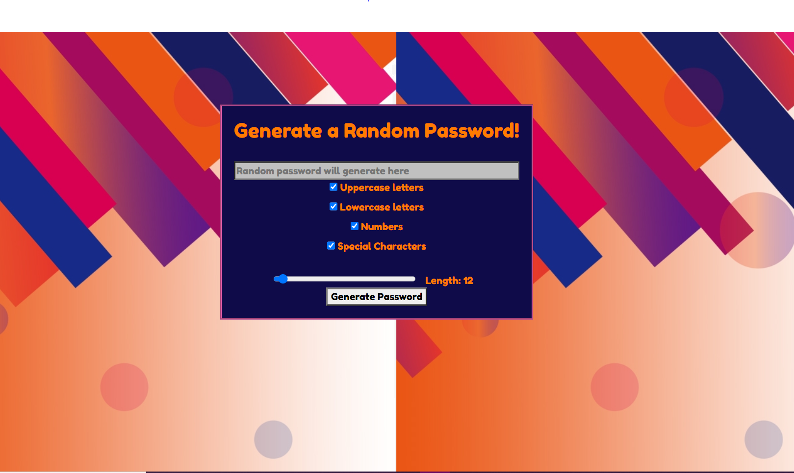

# Password-Generator

A random password generator created with HTML, CSS and JavaScript.
Allows user to choose between lowercase, uppercase, numbers and/or special characters with check boxes to generate a random password and a slider to choose a length between 8-128 characters.

Image of the application

<!--  -->

    

